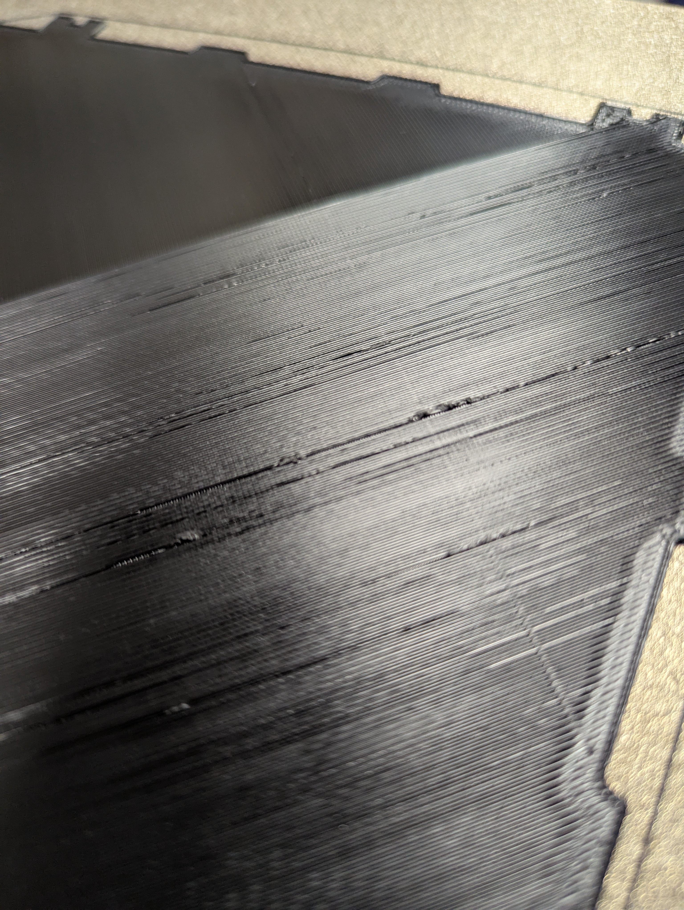
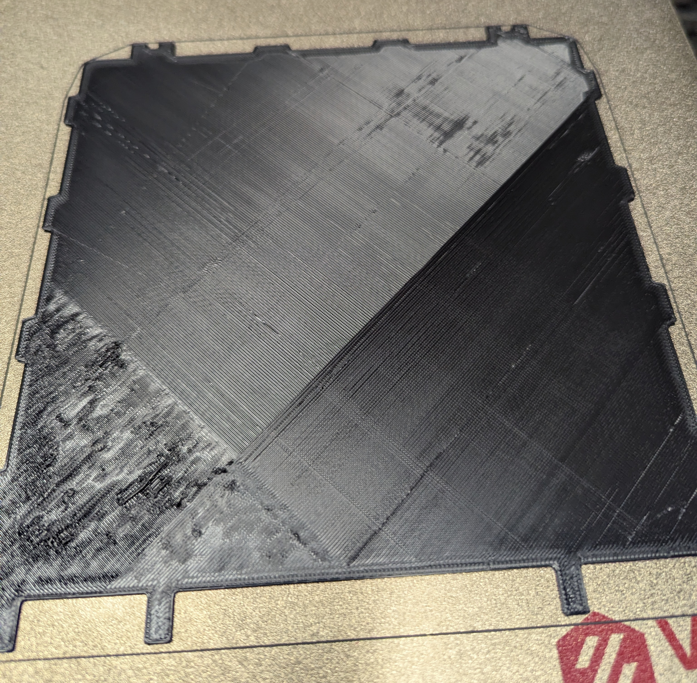

# The problem

## Intermittent failure to extrude

Extrusion would sometimes stop briefly and then restart, and sometimes
would stop and then never restart.

## High temperature readings

The NTC 3950 sensor on the EBB SB2209 CAN (RP2040) board would often
read >75 °C.
